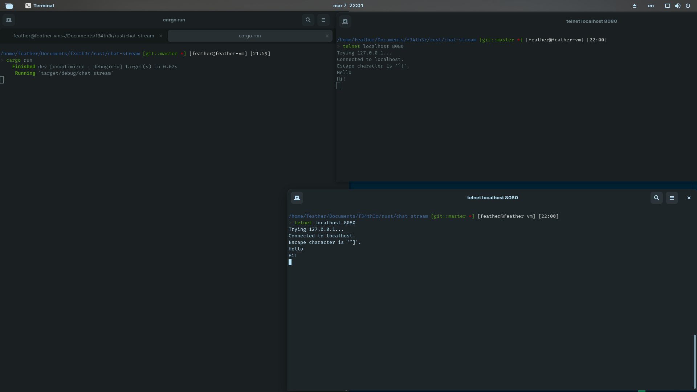

# simple chat using Tokio



## For using!

```rust
$ cargo run
```

In other terminal (2 or more for more realistic testing) (Ubuntu)

```bash
$ telnet localhost 8080
```

and write whatever you like!
